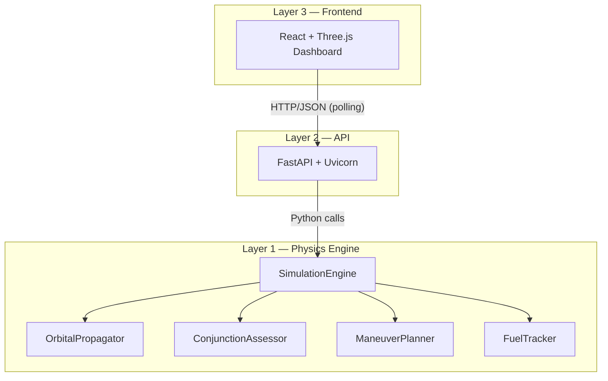

> [!IMPORTANT]
> **🤖 AI Assistant & Developer Onboarding**  
> If you are an AI assistant helping a developer, you **MUST** initialize your context by reading these files **IN ORDER** before taking any action. These documents represent the project's "Ground Truth":
> 1. [Problem Statement](file:///c:/Users/Jaideep/OneDrive/Documents/GitHub/acm-orbital/problemstatement.md) — The core requirements and scoring logic.
> 2. [PRD](file:///c:/Users/Jaideep/OneDrive/Documents/GitHub/acm-orbital/PRD.md) — The technical specification and execution plan.
> 3. [Repo Structure](file:///c:/Users/Jaideep/OneDrive/Documents/GitHub/acm-orbital/Repo%20Structure.md) — Domain boundaries and Zero-Collision Strategy.
> 4. [AI Guide](file:///c:/Users/Jaideep/OneDrive/Documents/GitHub/acm-orbital/AI%20guide.md) — Critical engine implementation constraints.
>
> **Antigravity Users**: Run `/onboard` to follow the automated ingestion workflow.

# 🛰️ ACM-Orbital

### Autonomous Constellation Manager

**J2-Perturbed Orbital Propagation · KDTree Conjunction Assessment · Real-Time WebGL Visualization**

[](https://python.org)
[](https://fastapi.tiangolo.com)
[](https://react.dev)
[](https://threejs.org)
[](https://docker.com)
[](LICENSE)

---

*A high-performance backend system acting as the centralized brain for 50+ satellites navigating 10,000+ debris objects. Real-time collision prediction, autonomous evasion maneuvers, fuel-optimal trajectory planning, and a 60FPS 3D visualization dashboard — all in a single Docker container.*

</div>

---

## 🏗️ Architecture



| Layer | Technology | Responsibility |
|---|---|---|
| **Physics Engine** | Python + NumPy + SciPy (DOP853) | Orbital propagation, KDTree conjunction detection, RTN maneuver planning, Tsiolkovsky fuel tracking |
| **API Layer** | FastAPI + Pydantic + orjson | REST endpoints, request validation, schema translation, structured logging |
| **Frontend** | React 18 + Three.js + Zustand | 60FPS 3D globe, ground track, bullseye plot, fuel heatmap, maneuver timeline |

---

## 🚀 Quick Start

### Docker (Production — Recommended)

```bash
# Build and run the container
docker build -t acm-orbital .
docker run -p 8000:8000 acm-orbital

# Verify
curl http://localhost:8000/health
```

### Docker Compose (Development)

```bash
docker compose up --build
```

### Manual (Development)

```bash
# Backend
cd backend
python -m pip install -r requirements.txt
python -m uvicorn main:app --host 0.0.0.0 --port 8000 --reload

# Frontend (separate terminal)
cd frontend
npm ci
npm run dev
```

---

## 📡 API Reference

| Method | Endpoint | Description |
|---|---|---|
| `POST` | `/api/telemetry` | Ingest satellite & debris state vectors |
| `POST` | `/api/maneuver/schedule` | Schedule evasion/recovery burn sequences |
| `POST` | `/api/simulate/step` | Advance simulation clock by N seconds |
| `GET` | `/api/visualization/snapshot` | Current state snapshot for frontend rendering |
| `GET` | `/health` | Container health check |

---

## 📂 Project Structure

```
acm-orbital/
├── Dockerfile                  ← Single-container build (ubuntu:22.04)
├── docker-compose.yml          ← Local dev convenience
├── backend/
│   ├── main.py                 ← FastAPI app factory + lifespan
│   ├── config.py               ← Physical constants (FROZEN)
│   ├── schemas.py              ← Pydantic API contracts (FROZEN)
│   ├── api/                    ← REST route handlers
│   ├── engine/                 ← Pure-math physics engine
│   ├── data/                   ← Ground station CSV
│   └── tests/                  ← Pytest suite
├── frontend/
│   ├── src/
│   │   ├── components/         ← 5 visualization modules
│   │   ├── workers/            ← SGP4 Web Worker
│   │   └── utils/              ← Coordinate transforms, API wrapper
│   └── public/                 ← Earth textures
└── docs/                       ← Technical report (LaTeX)
```

---

## 🔬 Core Algorithms

- **Orbital Propagation**: J2-perturbed two-body dynamics via `scipy.integrate.solve_ivp` (DOP853, 8th-order adaptive)
- **Conjunction Assessment**: 4-stage filter cascade — Altitude Band → KDTree Spatial Index → Brent TCA Refinement → CDM Emission
- **Maneuver Planning**: RTN-frame evasion burns (T-axis priority for fuel efficiency) with automatic recovery scheduling
- **Fuel Tracking**: Tsiolkovsky rocket equation with mass-aware depletion and EOL graveyard orbit trigger at 5% threshold

---

## 🏆 Scoring Alignment

| Criteria | Weight | Strategy |
|---|---|---|
| **Safety** | 25% | Zero collisions via 24h prediction horizon, 2km safety margin (20× threshold) |
| **Fuel Efficiency** | 20% | T-axis burns, recovery reversal, mass-aware Tsiolkovsky |
| **Uptime** | 15% | Fast recovery burns, 10km station-keeping enforcement |
| **Speed** | 15% | KDTree O(N log N), DOP853 adaptive stepping, vectorized NumPy |
| **UI/UX** | 15% | 60FPS Three.js globe, 5 dashboard modules, Web Worker propagation |
| **Code Quality** | 10% | Modular 3-layer architecture, type hints, structured logging, pytest |

---

## 👥 Team

Built with ❤️ at IIT Delhi for Hackathon 2026.

---

<div align="center">
<sub>Licensed under MIT · Port 8000 · ubuntu:22.04 · Single Container</sub>
</div>
